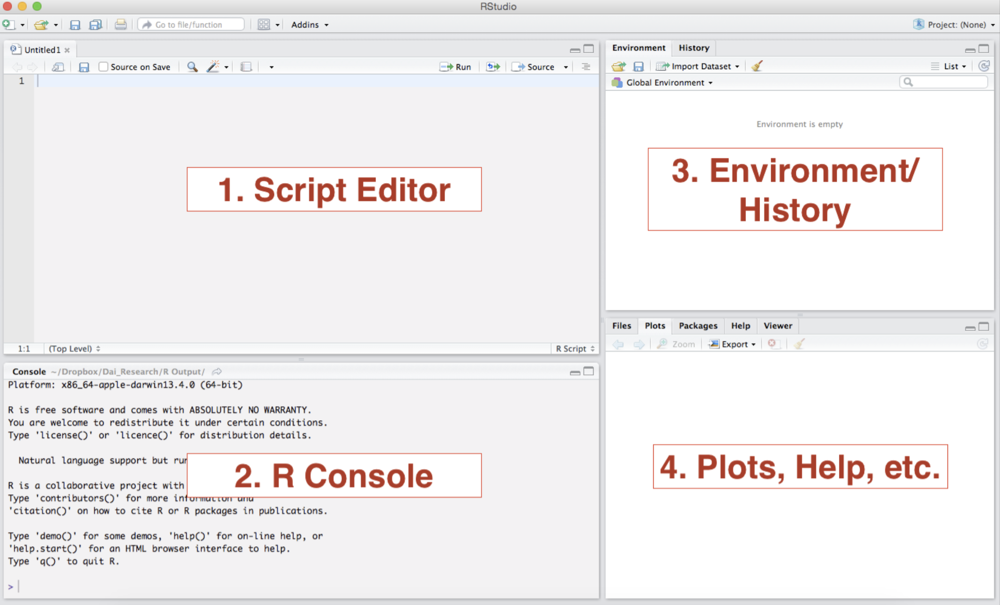

```{r setup, include=FALSE}
knitr::opts_chunk$set(echo = TRUE, message = FALSE, warning = FALSE)
```

## Welcome! `r emo::ji("wave")`

The practical component of the **Introduction to Data Science** course relies largely on *R* programming. Today will center around some of the necessary skills to perform the assignments for this course.

This week's tutorial will be divided in three parts. 

- First, we will speak about the R and RStudio infrastructure setup. 
- Second, we will remind you of the most important data structures in R and we will practice some basic commands to get you up to speed with working in R.
- Third, we will discuss some best practices in R. 


But first things first:
**Have you all successfully installed R and RStudio?**
Otherwise, [install R](https://cran.r-project.org/) first, then [install RStudio](https://www.rstudio.com/products/rstudio/) - or think about [updating](https://happygitwithr.com/install-r-rstudio.html) R, RStudio, and your installed packages.

**Have you all registered a free GitHub account?**
Otherwise, register [here](https://github.com/).

---

# R and RStudio: Basics

## The RStudio interface

*RStudio* is an integrated development environment (IDE) for R. Think of *RStudio* as a front that allows us to interact, compile, and render R code in a more instinctive way. The following image shows what the standard RStudio interface looks like:



1. **Console**: The *console* provides a means to interact directly with *R*. You can type some code at the *console* and when you press ENTER, R will run that code. Depending on what you type, you may see some output in the *console* or if you make a mistake, you may get a warning or an error message.

2. **Script editor**: You will utilize the *script editor* to complete your assignments. The *script editor* will be the space where files will be displayed. For example, once you download and open the bi-weekly assignment .Rmd template, it will appear here. The editor is a where you should place code you care about, since the code from the console cannot be saved into a script.

3. **Environment**: This area holds the abstractions you have created with your code. If you run `myresult <- 5+3+2`, the `myresult` object will appear there.

4. **Plots and files**: This area will be where graphic output will be generated. Additionally, if you write a question mark before any function, (i.e. `?mean`) the online documentation will be displayed here.


---

## Getting Help `r emo::ji("search")`

The key to learning `R` is: **Google**! We can give you an overview over basic `R` functions, but to really learn `R` you will have to actively use it yourself, trouble shoot, ask questions, and google! Help pages such as http://stackoverflow.com offer a rich archive of questions and answers by the `R` community. For example, if you google "recode data in r" you will find a variety of useful websites explaining how to do this on the first page of the search results. Also, don't be surprised if you find a variety of different ways to execute the same task. 

RStudio also has a useful help menu. In addition, you can get information on any function or integrated data set in `R` through the console, for example:
```
?plot
```

In addition, there are a lot of free `R` comprehensive guides, such as Quick-R at http://www.statmethods.net or the `R` cookbook at http://www.cookbook-r.com.

## Executing a line of code
To execute a single line of code. In RStudio, with the curser in the line you want `R` to execute, 

Press `command + return` (on macOS) or `Crtl + Enter` (on Windows).

To execute multiple lines of code at once, highlight the respective portion of the code and then run it using the operations above.


## Arithmetic in `R`
You can use `R` as a calculator!

|       |Operator | Example|
|:------|:-----|:----- |
| Addition    | `+`   | `2+4` |
| Subtraction |`-`    | `2-4` |
| Multiplication | `*`  | `2*4` |
| Division | `/` | `4/2` |
| Exponentiation| `^` |`2^4` |
| Square Root | `sqrt()` | `sqrt(144)`|
| Absolute Value | `abs()` | `abs(-4)` |

```{r}
4*9
sqrt(144)
```


## Logical operators
|       |Operator | 
|:------|:-----|
| Less than | `<` |
| Less than or equal to | `<=`|
| Greater than | `>` |
| Greater than or equal to | `>=` |
| Exactly equal to | `==` |
| Not equal to | `!=` |
| Not `x` | `!x` |
| `x` or `y` | `x | y`|
| `x` and `y` | ` x & y` |

Logical operators are incredibly helpful for any type of exploratory analysis, data cleaning and/or visualization task. 
```{r}
4 > 2
4 <= 2
```


# Objects in R

`R` stores information as an *object*. You can name objects whatever you like. Just remember to not use names that are reserved for build-in functions or functions in the packages you use, such as `sum`, `mean`, or `abs`. Most of the time, `R` will let you use these as names, but it leads to confusion in your code. 


## Assigning values to objects

A few things to remember

* Do not use special characters such as `$` or `%`. Common symbols that are used in variable names include `.` or `_`. 
* Remember that `R` is case sensitive.
* To assign values to objects, we use the assignment operator `<-`. Sometimes you will also see `=` as the assignment operator. This is a matter of preference and subject to debate among `R` programmers. Personally, I use `<-` to assign values to objects and `=` within functions.
* The `#` symbol is used for commenting and demarcation. Any code following `#` will not be executed.

Below, `R` stores the result of the calculation in an object named `result`. We can access the value by referring to the object name.
```{r}
result <- 5/3
result
```

If we assign a different value to the object, the value of the object will be changed.  
```{r}
result <- 5-3
result
```

## Data Types in R

There are four main variable types you should be familiar with:

* **Numerical**: Any number. **Integer** is a numerical variable without any decimals.
* **Character**: This is what Stata (and other programming languages such as Python) calls a string. We typically store any alphanumeric data that is not ordered as a character vector.
* **Logical**: A collection of `TRUE` and `FALSE` values.
* **Factor**: Think about it as an ordinal variable, i.e. an ordered categorical variable.


## Data Structures in R

R has many data structures, the most important ones for now are:

* **Vectors**
* **Lists**
* **Matrices**
* **Data frames**
* **Factors**

Here is a short overview with a few related operations that you can apply to the different structures.

### Vectors
```{r}
my_vector <- c(1, 2, 3)
my_character_vector <- c("Welcome", "everyone")
length(my_vector)
str(my_character_vector)
```

### Matrices

```{r}
my_matrix <- matrix(nrow=3, ncol=3)
dim(my_matrix)
```

### Lists

```{r}
my_list <- list(1, "a", TRUE)
my_list[2]
my_list[[2]]
```

### Data Frames

```{r}
my_df <- data.frame(id = letters[1:10], x = 1:10, y = 11:20)
```

Some useful operations to learn something about a data frame - more on this in a moment!
```
head(my_df)
tail(my_df)
dim(my_df)
nrow(my_df)
ncol(my_df)
str(my_df)
names(my_df)
```

### Factors

```{r}
# direct creation of factors
my_factor <- factor(c("single","single","married","married","single"))

# turning vectors into factors
my_vector <- c("single","single","married","married","single")
my_factor <- as.factor(my_vector)

levels(my_factor)
```

If you are thrilled by object classes in R by now, [here is more](https://swcarpentry.github.io/r-novice-inflammation/13-supp-data-structures/).

---


# Vectors 

Let's first focus on vectors as building blocks of most data structures you'll be working with.

A **vector** is one of the simplest type of data you can work with in `R`. "A vector or a one-dimensional array simply represents a collection of information stored in a specific order" (Imai 2017: 14). It is essentially a list of data of a single type (e.g. numerical, character, or logical). 

To create a vector, we use the function `c()` (``concatenate'') to combine separate data points. The general format for creating a vector in R is as follows:
`name_of_vector <- c("what you want to put into the vector")`

Suppose, we have data on the population in millions for the five most populous countries in 2016. The data come from the World Bank.
```{r}
pop1 <- c(1379, 1324, 323, 261, 208)
pop1
```

We can use the function `c()` to combine two vectors. Suppose we had data on 5 additional countries.
```{r}
pop2 <- c(194, 187, 161, 142, 127)
pop <- c(pop1, pop2)
pop
```

First, lets check which variable type our population data were stored in. The output below tells us that the object `pop` is of class *numeric*, and has the dimensions `[1:10]`, that is 10 elements in one dimension.
```{r}
str(pop)
```

Suppose, we wanted to add information on the country names. We can enter these data in *character* format. To save time, we will only do this for the five most populous countries.
```{r}
cname <- c("CHN", "IND", "USA", "IDN", "BRA")
str(cname)
```

Now, lets code a *logical* variable that shows whether the country is in Asia or not. Note that `R` recognizes both `TRUE` and `T` (and `FALSE` and `F`) as logical values. 
```{r}
asia <- c(TRUE, TRUE, F, T, F)
str(asia)
```

Lastly, we define a factor variable for the regime type of a country in 2016.  This variable can take on one of four values (based on data from the Economist Intelligence Unit): Full Democracy, Flawed Democracy, Hybrid Regimes, and Autocracy. Note that empirically, we don't have a "hybrid category" here. We could define an empty factor level, but we will skip this step here.
```{r}
regime <- c("Autocracy", "FlawedDem", "FullDem", "FlawedDem", "FlawedDem")
regime <- as.factor(regime)
str(regime)
```

Data types are important! `R` will not perform certain operations if you don't get the variable type right. The good news is that we can switch between data types. This can sometimes be tricky, especially when you are switching from a factor to a numerical type. 

Sometimes you have to do a work around, like switching to a character first, and then converting the character to numeric. You can concatenate commands: `myvar <- as.numeric(as.character(myvar))`.

We won't go into this too much here; just remember: Google is your friend!

Let's convert the factor variable `regime` into a character. Also, for practice, lets convert the `asia` variable to character and back to logical.
```{r}
regime <- as.character(regime)
str(regime)
asia <- as.character(asia)
str(asia)
asia <- as.logical(asia)
str(asia)
```

**Exercise 1**: Why won't `R` let us do the following?

`no_good <- (a,b,c)`

`no_good_either <- c(one, two, three)`


**Exercise 2**: What's the difference? (Bonus: What do you think is the class of the output vector?)
```{r, results="hide"}
diff <-c(TRUE,"TRUE")
```

**Exercise 3**: What is the class of the following vector?
```{r, results="hide"}
vec <- c("1", "2", "3")
```

### Vector operations
You can do a variety of things like have `R` print out particular values or ranges of values in a vector, replace values, add additional values, etc.  We will not get into all of these operations today, but be aware that (for all practical purposes) if you can think of a vector manipulation operation, `R` can probably do it. 

We can do arithmatic operations on vectors! Let's use the vector of population counts we created earlier and double it.
```{r}
pop1
pop1_double <- pop1 * 2
pop1_double
```

**Exercise 4**: What do you think this will do?
```{r, results="hide"}
pop1 + pop2
```

**Exercise 5**: And this?
```{r, results="hide"}
pop_c <- c(pop1, pop2)
```

### Functions
There are a number of special functions that operate on vectors and allow us to compute measures of location and dispersion of our data.

|       |Function | 
|:------|:-----|
| `min()` | Returns the minimum of the values or object. |
| `max()` | Returns the maximum of the values or object. |
| `sum()` | Returns the sum of the values or object. |
| `length()` | Returns the length of the values or object. |
| `mean()` | Returns the average of the values or object. |
| `median()` | Returns the median of the values or object. |
| `var()` | Returns the variance of the values or object. |
| `sd()` | Returns the variance of the values or object. |


```{r}
min(pop)
max(pop)
mean(pop)
```

**Exercise 6**: Using functions in `R`, how else could we compute the mean population value?
```{r, echo = F}
sum(pop)/length(pop)
```

### Accessing elements of vectors - Indexing
There are many ways to access elements that are stored in an object. Here, we will focus on a method called *indexing*, using square brackets as an operator.

Below, we use square brackets and the index `1` to access the first element of the top 5 population vector and the corresponding country name vector.
```{r}
pop1[1]
cname[1]
```

We can use indexing to access multiple elements of a vector. For example, below we use indexing to implicitly print the second and fifth elements of the population and the country name vectors, respectively.
```{r}
pop[c(2,5)]
cname[c(2,5)]
```

We can assign the first element of the population vector to a new object called `first`.
```{r}
first <- pop[1]
```

Below, we make a copy of the country name vector and delete the *last* element. Note, that we can use the `length()` function to achieve the highest level of *generalizability* in our code. Using `length()`, we do not need to know the index of the last element of out vector to drop the last element. 
```{r}
cname_copy <- cname
## Option 1: Dropping the 5th element
cname_copy[-5]
## Option 2 (for generalizability): Getting the last element and dropping it.
length(cname_copy)
cname_copy[-length(cname_copy)]
```

Indexing can be used to alter values in a vector. Suppose, we notice that we wrongly entered the second element of the regime type vector (or the regime type changed).
```{r}
regime
regime[2] <- "FullDem"
regime
```


**Exercise 7**: We made even more mistakes when entering the data! We want to subtract 10 from the third and fifth element of the top 5 population vector. *How would you do it*? 
```{r, results="hide", echo = F}
pop1_copy <- pop1 #Making a copy
pop1_copy[c(3,5)] <- -10 #Wrong!!
pop1_copy[c(3,5)] <- pop1_copy[c(3,5)] - 10 
```


### More functions
The myriad of functions that are either built-in to base `R` or parts of user-written packages are the greatest stength of `R`. For most applications we encounter in our daily programming practice, `R` already has a function, or someone smart wrote one. Below, we introduce a few additional helpful functions from base `R`.

|       |Function | 
|:------|:-----|
| `seq()` | Returns sequence from input1 to input2 by input3.|
| `rep()` | Repeats input1 input2 number of times.|
| `names()` | Returns the names (labels) of objects.|
| `which()` | Returns the index of objects.|

Let's create a vector of indices for our top 5 population data.
```{r}
cindex <- seq(from = 1, to = length(pop1), by = 1)
cindex
```

Suppose we wanted to only print a sequence of even numbers between 2 and 10. We can do so by adjusting the `by` operator.
```{r}
seq(2, 10, 2)
```

We can use the `rep()` function to repeat data.
```{r}
rep(30, 5)
```

Suppose, we wanted to record whether we had completed the data collection process for the top 10 most populous countries. First, suppose we completed the process on every second country.
```{r}
completed <- rep(c("yes","no"), 5)
completed
```

Now suppose that we have completed the data collection process for the first 5 countries, but not the latter 5 countries (we don't have their names, location, or regime type yet).
```{r}
completed2 <- rep(c("yes","no"), each = 5)
completed2
```

We can give our data informative labels. Let's use the country names vector as labels for our top 5 population vector.
```{r}
names(pop1)
cname
names(pop1) <- cname
names(pop1)
pop1
```

We can use labels to access data using indexing and logical operators. Suppose, we wanted to access the population count for Brazil in our top 5 population data.
```{r}
pop1[names(pop1) == "BRA"]
```

**Exercise 8** Access all top 5 population ratings that are greater or equal than the mean value of population ratings.
```{r, echo = F}
mean(pop1)
pop1[pop1 >= mean(pop1)]
```

**Exercise 9** Access all top 5 population ratings that are less than the population of the most populous country, but not the US.
```{r, echo = F}
pop1[pop1 < max(pop1) & names(pop1) != "USA"]
```

### Operating on multiple vectors simultaneously
We did not work with data frames yet, but remember that our data input is ordered. The first element of the `pop1` vector corresponds with the first element of the `cname`, `regime`, and `asia` vectors. We can use this to run more sophisticated queries on our data.

Suppose, we wanted to know the regime type of Indonesia. Given that our vectors are ordered, we can use indexing to extract the data. First, lets see what happens if we run a simple logical query.
```{r}
cname == "IDN"
regime[cname == "IDN"]
```

We can also use the `which()` function that returns the index of the vector element.
```{r}
which(cname == "IDN")
regime[which(cname == "IDN")]
```

Using logical statements, we can run more complex queries. Below, we print the population count for all Asian countries within the top 5 most populous countries that are not autocracies.
```{r}
pop1[asia == T & regime != "Autocracy"]
```

---

# Working with R

## R Packages `r emo::ji("package")`

For the most part, *R Packages* are collections of code and functions that leverage R programming to expand on the basic functionalities. There are a plethora of packages in *R* designed to facilitate the completion of tasks, built by the R community. In later parts of this course, you will also learn how to write packages yourself.

Unlike other programming languages, in *R* you only need to install a package once. The following times you will only need to load the package. **As a good practice I recommend running the code to install packages only in your R console, not in the code editor.** You can install a package with the following syntax

```r
install.packages("name_of_your_package") #note that the quotation marks are mandatory at this stage
```

Once the package has been installed, you just need to "call it" every time you want to use it in a file by running:

```r
library("name_of_your_package") #either of this lines will require the package
library(name_of_your_package) #library understands the code with, or without, quotation marks
```

**It is extremely important that you do not have any lines installing packages for your assignments because the file will fail to knit**

---


## Working directory

The *working directory* is just a file path on your computer that sets the default location of any files you read into R, or save out of R. Normally, when you open *RStudio* it will have a default directory (a folder in your computer). You can check you directory by running `getwd()` in your console:

```r
#this is the default in my case
getwd()
#[1] "/Users/l.oswald"
```

**When your RStudio is closed and you open a file from your finder in MacOS or file explorer in Windows, the default working directory will be the folder where the file is hosted**

---

### Setting your working directory

You can set you directory manually from RStudio: use the menu to change your working directory under Session > Set Working Directory > Choose Directory.

You can also use the `setwd()` function:

```r
setwd("/path/to/your/directory") #in macOS
setwd("c:/path/to/your/directory") #in windows
```

---

### Working with R Projects

Another option that allows you to circumvent the folder structure mess to some degree are R Projects.
We highly recommend working in Projects because they are easily integrated with Git - something you will discover in the lecture tomorrow!

---

Time for more *examples*!

Below, we will use use the `foreign` package to import a .csv file. To make the `foreign` package available for use, install it and then use the `library()` command to load it. While packages need to be installed only once, the `library()` command needs to be run every time you want to use a particular package. On many machines, the `foreign` package is pre-installed. We install it above for practice purposes.
```{r, warning = F}
#install.packages("foreign") #alternatively use "Install" button 
library(foreign)
```

In this example, we will use a subset of data from the [Armed Conflict Location & Event Data Project (ACLED)](https://www.acleddata.com/), which offers real-time data and analysis on political violence and protests around the world. The `ACLED_countries.csv` dataset includes the count of riot and protest events from January 2000 to December 2019 for many countries.[^4] 

[^4]: ACLED uses the following definition: "A protest describes a non-violent, group public demonstration, often against a government institution. Rioting is a violent form of demonstration," see Raleigh, C. and C. Dowd (2015): Armed Conflict Location and Event Data Project (ACLED) Codebook.)

## Importing data

Most data formats we commonly use are not native to `R` and need to be imported. Luckily, there is a variety of packages available to import just about any non-native format. One of the essential libraries is called `foreign` and includes functions to import .csv, .dta (Stata), .dat, ,.sav (SPSS), etc. 


```{r}
mydata <- read.csv("ACLED_countries.csv",
                   stringsAsFactors = F)
```

# Data Frames 

Let's now go a bit deeper with data frames, a structure you'll probably encounter every 
time you work with `R`.

Let's find out what these data look like. First, use the `str()` function to explore the variable names and which data class they are stored in. Note: `int` stands for `integer` and is a special case of the class `numeric`.
```{r}
str(mydata)
```

If we are only interested in what the variables are called, we can use the `names()` function.
```{r}
names(mydata)
```

We can alter the names of vectors by using the `names()` function and indexing. Because data frames are essentially just combinations of vectors, we can do the same for variable names inside data frames. Suppose we want to change the variable `nconflicts`.
```{r}
names(mydata)[3] <- "nconflict"
names(mydata)
```

We can use the `summary()` function to get a first look at the data.
```{r}
summary(mydata)
```

A data frame has two dimensions: rows and columns. 
```{r}
nrow(mydata) # Number of rows
ncol(mydata) # Number of columns
dim(mydata) # Rows first then columns.
```

### Accessing elements of a data frame - Indexing 2
As a rule, whenever we use two-dimensional indexing in `R`, the order is: `[row, column]`. To access the first row of the data frame, we specify the row we want to see and leave the column slot following the comma empty.
```{r}
mydata[1, ]
```

We can use the concatenate function `c()` to access multiple rows (or columns) at once. Below we print out the first and second row of the dataframe.
```{r}
mydata[c(1,2), ]
```

We can also access a range of rows by separating the minimum and maximum value with a `:`. Below we print out the first five rows of the dataframe. 
```{r}
mydata[1:5,]
```

If we try to access a data point that is out of bounds, `R` returns the value `NULL`. 
```{r}
mydata[3,7]
```

**Exercise 10** Access the element of the dataframe `mydata` that is stored in row 1, column 1.
```{r, echo = F}
mydata[1,1]
```

**Exercise 11** Access the element of the data frame `mydata` that is stored in column 3, row 100.
```{r, echo=FALSE}
mydata[100,3]
```

### The `$` operator

The `$` operator in `R` is used to specify a variable within a data frame. This is an alternative to indexing.
```{r}
mydata$nconflict
```

### `table()` function
The `table()` function can be used to tabularize one or more variables. For example, lets find out how many observations (i.e. individual countries) we have per region.
```{r}
table(mydata$region)
```

Using logical operations, we can create more complex tabularizations. For example, below, we show how many countries have above average number of conflict events per region.
```{r}
summary(mydata$nconflict)
table(mydata$region, mydata$nconflict > mean(mydata$nconflict))
```

**Exercise 12**: How would you access all elements of the variable `country` using indexing rather than the `$` operator?
```{r, echo = F}
head(mydata[, 1])
head(mydata[, "country"])
```

**Exercise 13**: How would you find the maximum value for number of events using the `$` operator?
```{r, echo = F}
max(mydata$nconflict)
```

**Exercise 14**: Print the country that corresponds to the maximum world population value using the `$` operator and indexing!
```{r, echo = F}
mydata$country[mydata$nconflict == max(mydata$nconflict)]
```

**Exercise 15**: Print out every second element from the variable `country` using indexing methods and the sequence function `seq()`.
```{r, echo = F}
head(mydata$country[seq(1, length(mydata$country), 2)])
```

## NAs in `R`
`NA` is how `R` denotes missing values. For certain functions, `NA`s cause problems.
```{r}
vec <- c(4, 1, 2, NA, 3)
mean(vec) #Result is NA!
sum(vec) #Result is NA!
```

We can tell `R` to remove the NA and execute the function on the remainder of the data.
```{r}
mean(vec, na.rm = T)
sum(vec, na.rm = T)
```

## Adding observations
First, lets add another observation to the data. Suppose we wanted to add an observation for Germany, which will be a missing value. We can use the same operations we used for vectors to add data. Here, we will use the `rbind()` function to do so. `rbind()` stands for "row bind." Save the output in a new data frame!
```{r}
obs <- c("Germany", "Europe", NA, NA, NA)
mydata_new <- rbind(mydata, obs)
dim(mydata_new)
```

## Adding variables
We can also create new variables that use information from the existing data. If we know the number of conflict events without fatalities by country, we can calculate the number of conflict events *with* fatalities to generate the variable `nconflict_fatalities`. By using the `$` operator, we can directly assign the new variable to the data frame `mydata_new`.
```{r}
mydata$nconflict_fatalities <- mydata$nconflict - mydata$nconflict_no_fatalities
head(mydata, 3) #prints out the first 3 rows of the data frame
```

We could also compute the average number of fatalities per conflict, computed as the sum of fatalities (`fatalities` variable) divided by the number of conflicts (`nconflict` variable).
```{r}
mydata$av_fatalities <- mydata$fatalities/mydata$nconflict
```

## Subsetting data 
Suppose we want to figure out which country in Northern Africa has the highest number of riot and protest events. We can figure this out by first subsetting our dataset to only include countries in the region, then looking up the maximum value for `nconflict`. Below, we assign the output to a new object called `mydata_na`.
```{r}
mydata_na <- mydata[mydata$region == "Northern Africa",]
max(mydata_na$nconflict)
mydata_na$country[mydata_na$nconflict == max(mydata_na$nconflict)]
```

# Working with R II

## Saving data 
Suppose we wanted to save this newly created data frame. We have multiple options to do so. If we wanted to save it as a native `.RData` format, we would run the following command. 
```
# Make sure you specified the right working directory!
save(mydata, file = "mydata_new.RData")
```

Most of the time, however, we would want to save our data in formats that can be read by other programs as well. `.csv` is an obvious choice.
```
write.csv(mydata_new, file = "mydata_new.csv")
```

## Dealing with errors in R

Errors in R occur when code is used in a way that it is not intended. For example when you try to add two character strings, you will get the following error:

```r
"hello" + "world"
Error in "hello" + "world": non-numeric argument to binary operator
```

Normally, when something has gone wrong with your program, *R* will notify you of an error in the **console**. There are errors that will prevent the code from running, while others will only produce **warning** messages. In the following case, the code will run, but you will notice that the string **"three"** is turned into a NA.

```r
as.numeric(c("1", "2", "three"))
Warning: NAs introduced by coercion
[1]  1  2 NA
```

Since we will be utilizing widely used packages and functions in the course of the semester, the errors that you may come across in the process of completing your assignments will be common for other R users. Most errors occur because of typos. A Google search of the error message can take you a long way as well. Most of the times the first entry on **stackoverflow.com** will solve the problem.   

---

## The double colon operator ::

You may have noted in the previous section that the functions were preceded by their package name and two colons, for example: `readr::read_rds()`. The double colon operator `::` helps us ensure that we select functions from a particular package. We utilize the operator to explicitly state where the function is coming. This may become even more important when you are doing data analysis as part of a team further in your careers. Though it is likely that this will not be a problem during the course, we can try to employ the following convention `package_name::function()` to ensure that we will not encounter errors in our knitting process:

```r
dplyr::select()
```
---

Let's look at what happens when we load `tidyverse`.

```r
library(tidyverse)

#── Attaching packages ──────────────────────────────────────────────────────────────────────────── tidyverse 1.3.0 #──
#✓ ggplot2 3.3.2     ✓ purrr   0.3.4
#✓ tibble  3.0.3     ✓ dplyr   1.0.2
#✓ tidyr   1.1.2     ✓ stringr 1.4.0
#✓ readr   1.3.1     ✓ forcats 0.5.0
#── Conflicts ─────────────────────────────────────────────────────────────────────────────── tidyverse_conflicts() #──
#x dplyr::filter() masks stats::filter()
#x dplyr::lag()    masks stats::lag()
```

You may notice that *R* points out some conflicts where some functions are being masked. The default in this machine will become the `filter()` from the `dplyr` package during this session. If you were to run some code that is based on the `filter()` from the `stats` package, your code will probably result in errors.

---

# Best practices

Let us conclude the tutorial with some notes on best practices in R.
There is a multitude of collections on best practices online, for example, some very useful ones are [here](https://www.r-bloggers.com/2018/09/r-code-best-practices/).

## Script structure

When structuring your scripts, remember a few things

* Libraries go first
* Hard coded variables (e.g. when reading in data) go second
* Relative paths over absolute paths (give your friends and colleagues a chance to execute your scripts without trouble)

## Naming conventions

In summary, we can say: always use easy to interpret names and don’t use whitespaces in file or variable names! Some *good* examples:

* my_file.R
* my_vector <- c(1,2,3)
* this_function()

## Spacing

It is somewhat easier to read if you generally leave a space after a comma

* my_function(1:10, c(2, 4))

## Repetition

When you start copying and pasting code (creating a lot of redundancy), you might want to consider slimming down your code by creating a function. Functions? Let us leave this as a note of caution and return to functions and efficient code in one of our very last sessions! :-) 


## Actually learning R `r emo::ji("backpack")`

Again, the key to learning `R` is: **Google**! We can only give you an overview over basic `R` functions, but to really learn `R` you will have to actively use it yourself, trouble shoot, ask questions, and google! It is very likely that someone else has had the exact same or just *similar enough* issue before and that the R community has answered it with 5+ different solutions years ago. `r emo::ji("wink")`

---

# Sources {-}

This script draws heavily on the materials for the Introduction to R workshop within the Data Science Seminar series at Hertie, created by Therese Anders. 

Economist Intelligence Unit (2017): *Democracy Index*. https://infographics.economist.com/2017/DemocracyIndex/.

Imai, Kosuke (2017): *Quantitative Social Science. An Introduction*. Princeton and Oxford: Princeton University Press.

Raleigh, Clionadh, Andrew Linke, Håvard Hegre and Joakim Karlsen. 2010. Introducing ACLED – Armed Conflict Location and Event Data. *Journal of Peace Research* 47(5), 651-660.

World Bank (2017): *Population, total*. https://data.worldbank.org/indicator/sp.pop.totl?end=2016&start=2015.
