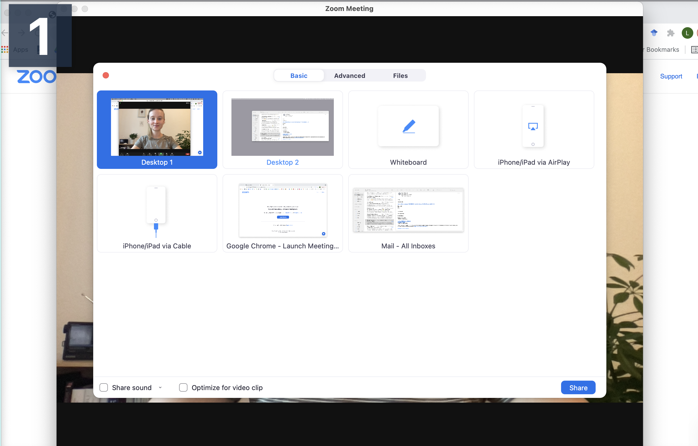
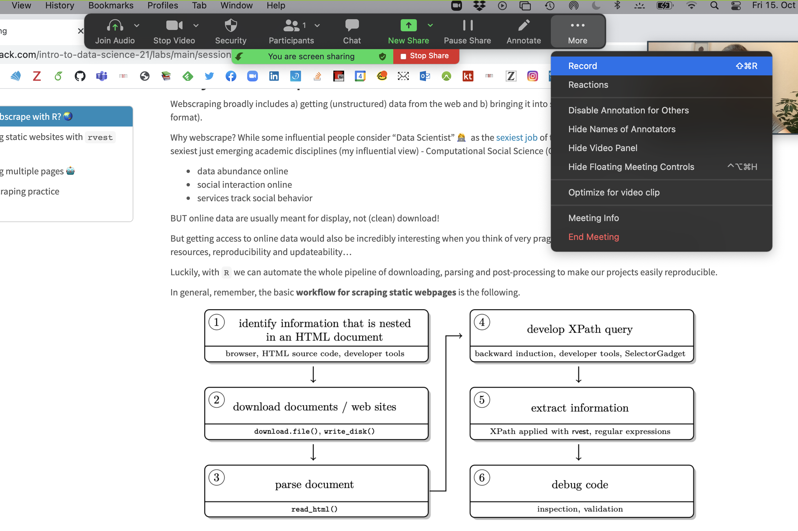
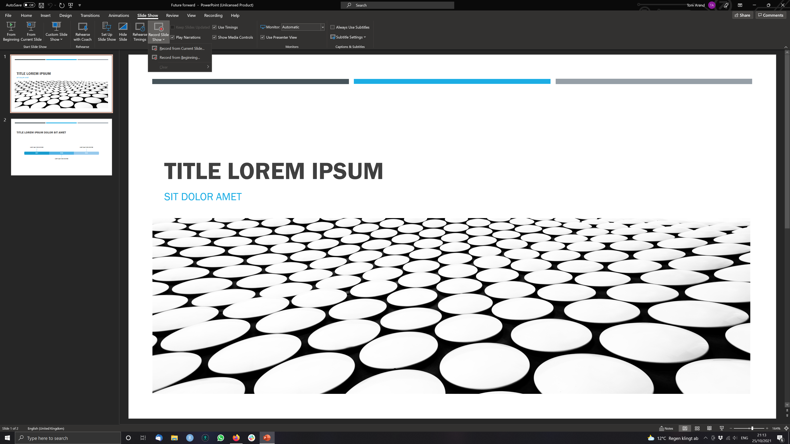
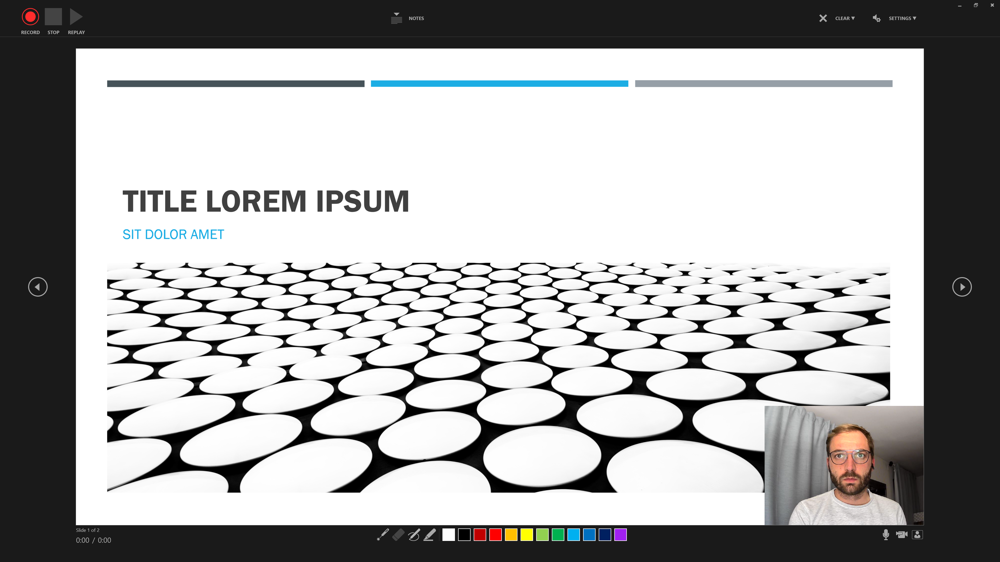
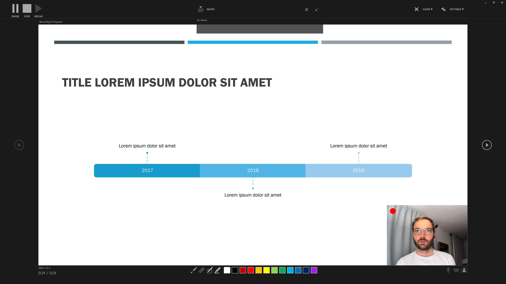
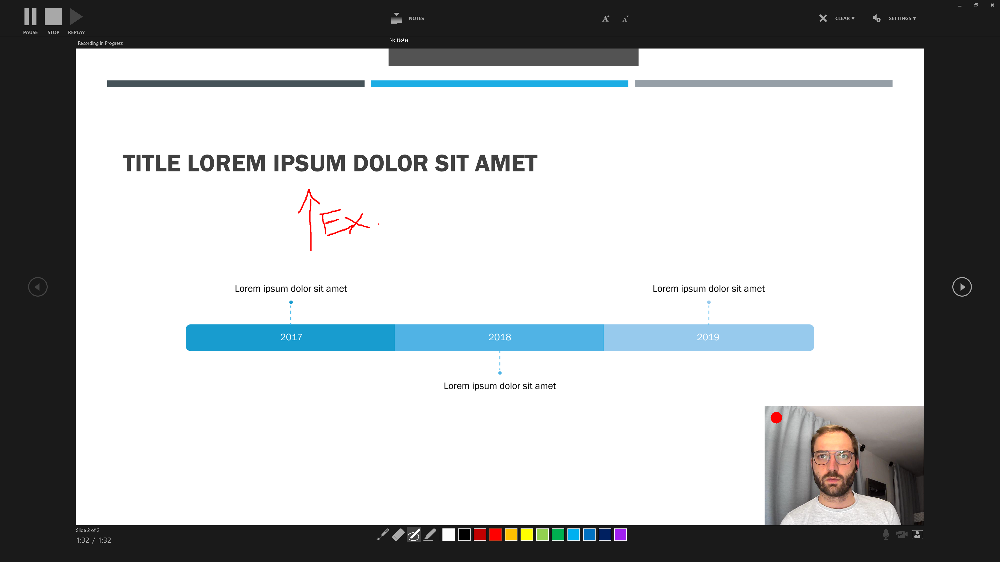

```{r setup, include=FALSE}
knitr::opts_chunk$set(echo = TRUE)
options(digits=2)

# save the built-in output hook
hook_output <- knitr::knit_hooks$get("output")

# set a new output hook to truncate text output
knitr::knit_hooks$set(output = function(x, options) {
  if (!is.null(n <- options$out.lines)) {
    x <- xfun::split_lines(x)
    if (length(x) > n) {
      # truncate the output
      x <- c(head(x, n), "....\n")
    }
    x <- paste(x, collapse = "\n")
  }
  hook_output(x, options)
})

colorise <- function(x, color) {
  if (knitr::is_latex_output()) {
    sprintf("\\textcolor{%s}{%s}", color, x)
  } else if (knitr::is_html_output()) {
    sprintf("<span style='color: %s;'>%s</span>", color,
      x)
  } else x
}

```
***
Welcome back! I hope you all enjoyed the course-free Midterm Week! `r emo::ji("beach with umbrella")`

Last session we talked a bit about how you might scrape innovative data from the web. Collecting data is not an end in itself, rather you do it to be able to run models that explore, infer or predict outcomes. We won't focus on the statistical considerations that inform your model choice, instead we will show you how to: 

* use formulas to specify multiple models
* process (estimate) model results with `broom`
* summarise outputs with `modelsummary`
* communicate results through plots and tables

***
# The Model Workflow with R

While the last session dealt with one of the sexier areas of Data Science (Web Scraping), today we will go back to the **bread and butter** `r emo::ji("bread")` of any self-respecting data scientist - modelling! 

But if we are not even talking about ML, DL or model choice, why bother? Well, as with most things it is worth to revisit fundamentals from time to time. By investing just a little more effort here, we can create *much better* reports and papers! 

In general, remember, your basic **workflow for evaluating and reporting models** is the following:

```{r, fig.align='center', echo=F, out.width = "90%"}
  knitr::include_graphics("pics/data-science-communicate.png")
```

Today we will mostly deal with the model and communicate steps in the graph. 

***
# Setup

Before we get started with the actual coding we need to load a few packages and get some data. We are using [this WHO dataset](https://www.kaggle.com/kumarajarshi/life-expectancy-who) on life expectancy.

```{r, message=F, comment=F}
pacman::p_load(kableExtra, tidyverse, broom, modelsummary, specr, janitor, modelr)

life_expec_dat <- read_csv("life_expectancy.csv") %>% 
  janitor::clean_names() %>% 
  mutate(developed = if_else(status == "Developed", 1, 0),
         large = if_else(population > 50000000, 1, 0))
head(life_expec_dat)
```


***
# Using Formulae in R  `r emo::ji("teacher")`

R as coding language was specifically designed with statistical analysis in mind. Therefore the founding fathers of R `r emo::ji("raising hands")` - in their infinite wisdom - decided to create a special object class (called `formula`) to help us run models.

## Syntax

A quick recap on the syntax that you can use within formulae. The `~` sign generally differentiates between dependent and independent variables. The `+` sign is used to distinguish between independent variables. Here are a few other lines that are nice to know:   

```{r, eval=F}
y ~ x1 + x2 # standard formula

y ~ . # include all other columns in data as x vars

y ~ x1 * x2 # Interaction terms

y ~ x + I(x^2) # higher order terms
```

Formulae are very straightforward to work with. To avoid any errors you should follow the following two steps. 

**Step 1:** create a string containing the written formula. The `paste` function from last week is useful for this.

```{r}
formula_string <- paste("life_expectancy", "~ gdp")
formula_string
```

**Step 2:** transform the string into R class formula. Only then can you plug it into the model function.

```{r}
form
form <- as.formula(formula_string) # needs to be transformed to correct class
```

Here is the proof that both ways of doing it are identical.

```{r}
form <- lm(form, data = life_expec_dat)
reg <- lm(life_expectancy ~ gdp, data = life_expec_dat)
reg <- glm(life_expectancy ~ gdp, family = "gaussian", data = life_expec_dat)


form$coefficients == reg$coefficients

```

## For Iteration 

We encourage you to **fit many models**, ranging from simple to complex, and formulae can help you in the iteration process.

Often, the modelling process requires you to run the same specification with **multiple configurations** of both **dependent** and **independent** variables. Model formulae make running many similar models super easy:

**Step 1**: You define a function that let's you plug in different variables at x or y. These functions take the y or x variable(s) as a string and return a model object.

```{r}
# function to include different y variables.

lm_fun_iter_y <-  function(dep_var) {
  lm( as.formula(paste(dep_var, "~ gdp")), data = life_expec_dat)
}

# function to include different x variables. 

lm_fun_iter_x <- function(indep_var) {
  lm( as.formula(paste("life_expectancy ~", paste(indep_var, collapse = "+"))), data = life_expec_dat)
}

## check what the function does
#lm_fun_iter_x <- function(indep_var) {
#  print(paste("life_expectancy ~", paste(indep_var, collapse = "+")))
#}
```

`r colorise("Notice:", "red")` It is unlikely you will run just a simple bivariate regression (i.e. your model will include many independent variables). Therefore, we need to use a nested paste function that combines (`collapse()`) the input character vector with `+`.

**Step 2**: You use `map()` (cf. [lab-session 4](https://raw.githack.com/intro-to-data-science-21/labs/main/session-4-databases/4-databases.html) to iterate the model over a vector or list of input variables:

```{r}
# create vector of variables to iterate over
vars <- life_expec_dat %>% 
  select(-c("life_expectancy", "country")) %>% 
  names()

# run a bivariate model for each column
biv_model_out <-  vars %>%
  map(lm_fun_iter_x)

biv_model_out
```

This returns a list of all the models that your ran. Given that there are a quite a few models now, so it might be an idea to retain the names of the variables that you feed into your model. You can do this with `purrr::set_names()`.

```{r}
# run a bivariate model for each column
biv_model_out_w_names <-  vars %>%
  set_names() %>% 
  map(lm_fun_iter_x)

biv_model_out_w_names$year 
```

But say we are interested to see what effect gdp has on life_expectancy. Multiple potential combinations make sense. What if you want to run several different multivariate models? In addition to the code from the lectures you could use `modelR::formulas`:

```{r}
# create list of combinations of vars
indep_vars_combos <- modelr::formulas(~life_expectancy,
                       "Bivariate OLS"  = ~ gdp,
                       "Multiple OLS" = ~ gdp + total_expenditure + population + alcohol + bmi ,
                       "Interaction" = ~ population + gdp * total_expenditure,
                       "Polynomial" = ~ gdp + I(gdp^2))
  
  
multiv_model_out <- indep_vars_combos %>%  map(lm, data = life_expec_dat)

multiv_model_out[[1]]
```

As you can see the function in the lecture is a lot more powerful, but in my admittedly very modest experience, the preceding code resembles the actual scientific workflow more closely. 

***
# Specification Curve Analysis

In the above example, I made a conscious choice to run these four specific models. This conscious choice should reflect insights from theory (here: not so much) and be defensible (eh...). Unfortunately, some researchers argue that by making a conscious choice, I select an arbitrary or possibly even biased model specification. They propose to approach model specification analytically. 

They call this Specification Curve Analysis, or Multiverse Analysis. There is a very nice package to run this: `specr`. In very simplistic terms it follows this path:

**First** you compile a list of defensible “model ingredients”:  

```{r}
setup_specs(
  y = c("life_expectancy"),
  # We add an additional dependent variable
  x = c("gdp", "log(gdp)", "I(gdp^2)", "gdp * total_expenditure"),
  # We are not sure which independent variable is better
  model = c("lm", "glm"),
  # We only use linear model or more complicated one
  controls = c("population", "alcohol", "bmi"))

```
**Second** you define additional analytical choices such as: model family, potential subgroups to run it over etc. 

```{r}
# Run specification curve analysis (under the hood it uses setup_specs())
results <- run_specs(df = life_expec_dat, 
                     y = c("life_expectancy"),               # We add an additional dependent variable
                     x = c("gdp", "log(gdp)", "I(gdp^2)", "gdp:total_expenditure"),         # We are not sure which independent variable is better
                     model = c("lm", "glm"),           # We only use linear model or more complicated one
                     controls = c("population", "alcohol", "bmi"),
                     subsets = list(developed = unique(na.omit(life_expec_dat$developed))) # so it is 1 or 0, not sure why author of pkg choose to do it this way
)


```

**Third** You inspect the specification curve to understand how robust your findings are to different analytical choices.

```{r}
plot_decisiontree(results, 
                  legend = TRUE)
```
This decision tree helps illustrate where and when you had to make a choice and how many models you might alternatively have specified.

More concretely you could also look at some summary statistics for your p-values across the different model specifications:

```{r}
summarise_specs(results, 
                var = c("std.error", "estimate"))
```

The statistic `r colorise("mad", "red")` stands for `r colorise("median absolute deviation", "red")`.

A more intuitive way of inspecting the results might lie in visualising them. 

```{r}
plot_specs(results)
```

**Plot A** denotes: 
* X-axis = ordered model specifications (from most negative effect to most positive effect)
* Y-axis = standardized regression coefficient for the IV-DV relationship
* Points = the standardized regression coefficient for a specific models
* Error bars = 95% confidence intervals around the point estimate

**Plot B** denotes: 
* X-axis = ordered model specifications (the same as panel A)
* Y-axis (right) = analytic decision categories
* Y-axis (left) = specific analytic decisions within each category
* Lines = denote that a specific analytic decision was true for that model specification

Without putting much thought into our model it looks like gdp (depending on the specification) has either no effect or positive effects on life_expectancy. This just goes to show how *careful* one has to approach the task of *correctly specifying a model*! 


:::: {.noticebox data-latex=""}
::: {.center data-latex=""}
**Watch Out!**
:::

Be careful and **selective** when you use specification curve analysis! It is not a tool that you should apply to each and every potential paper. Especially, if you have not taken a course on **causal inference**. Specification curve analysis, when it includes variables that act as **colliders** or **mediators** might actually legitimise an otherwise wrongly specified model!
::::


***
# Model Output with `broom`

In the lecture we saw, that vanilla model lists can be unwieldy. Simon also pointed out that we are interested in three main aspects of out model outputs:

* **Estimated coefficients** and associated standard errors, T-statistics, p-values, confidence intervals
* **Model summaries**, including goodness of fit measures, information on model convergence, number of observations used
* **Observation-level** information that arises from the estimated model, such as fitted/predicted values, residuals, estimates of influence

Extracting this information from the vanilla model output is possible, but hardly ideal:

```{r, out.lines = 10}
str(multiv_model_out[[3]])

summary(multiv_model_out[[3]])
```

## Tidying Model Objects

Luckily we don't have to deal with this. We use a package called `broom` that is part of the [tidyverse](https://www.tidyverse.org/) and more precisely [tidymodels](https://www.tidymodels.org/). The latter offers a lot of cool packages that have their own tutorials, so check them out! `r emo::ji("strong")`. 

We will only focus on broom. As a reminder, here are the three key broom functions that you need to learn:

1) `tidy()`: Summarizes information about model components.

```{r}
broom::tidy(multiv_model_out[[3]], conf.int = TRUE, conf.level = 0.95)
```

2) `glance()`: Reports information about the entire model.

```{r}
broom::glance(multiv_model_out[[3]])
```

3) `augment()`: Adds information about observations to a dataset.

```{r}
augment(multiv_model_out[[3]], se_fit = TRUE) 
```

I mean, doesn't this look a lot more accessible?


## Broom with Many Models

Where `broom` really shines, is in dealing with many models like we have in our `multiv_model_out`. It allows us to easily move away from the generally painful-to-deal-with lists and create yet retain each of the three important model returns. Since our example replicates several variables in different models, I include the .id argument in map. It adds a column to our tibble with an **model identifier**. In our case this identifier consists of the names of the elements in the list.

```{r}
multiv_model_out_broom <- map_dfr(multiv_model_out, broom::tidy, .id = "model_type")
multiv_model_out_broom
```

Now that we have our multiple model outputs in a format that we can work with normally, it is time to start thinking about visualizing our results. You can plot the residuals, the goodness of fit statistics etc. Similarly you could also use the `glance()` to provide some robustness statistics or descriptive tables. 

What we will be focusing on in the next section is how to **present your results**!

***
# Modelling Results with `modelsummary`

For this we will use the excellent `modelsummary` package by [Vincent Arel-Bundock's](https://vincentarelbundock.github.io/modelsummary/). Though there are many other options to choose from, we highly recommend you give it a shot! 

One reason that we like this package, is that it combines both ways of presenting model results, in a **table** or in a **coefficient plot**. As we saw in the lecture each method has its advantages and its drawbacks. Therefore, we will cover both here.

## Using Regression Tables

The workhorse function in `modelsummary` is unsurprisingly `modelsummary()`. `r emo::ji("thinking")`

Here we only need to input the `r colorise("models list", "red")` as, the function already takes care of the tidying for us.

```{r}

modelsummary(multiv_model_out, output = "kableExtra")
```

It looks pretty solid already, but unfortunately it is not yet good enough.

**Set acceptable number of digits**:

```{r, eval=F}
modelsummary(multiv_model_out, 
             output = "kableExtra",
             fmt = "%.2f") # 2-digits and trailing 0
```

And let us also report **only the C.I.** and get rid of the p-values and the Intercept term:

```{r}
model_table <- modelsummary(multiv_model_out, 
             output = "kableExtra",
             fmt = "%.2f",  # 2-digits and trailing 0  
             estimate  = "{estimate}",
             statistic = "conf.int",
             coef_omit = "Intercept") 

```

Would it not also look more professional if we had our **coefficients begin with capital letter**? And how about we get rid of some of the bloated goodness of fit statistics?

```{r}
mod_table <- modelsummary(multiv_model_out, 
             output = "default",
             fmt = "%.2f",  # 2-digits and trailing 0  
             estimate  = "{estimate}",
             statistic = "conf.int",
             coef_omit = "Intercept",
             coef_rename=c("gdp"="Gdp", "bmi"="Avg. BMI", "alcohol" = "Alcohol Consum.","population"= "Pop.", 
                           "gdp:total_expenditure" = "Gdp * Health Expenditure (total)",
                           "total_expenditure"="Health Expenditure (total)", "I(gdp^2)" ="Gdp²"),
             gof_omit = 'DF|Deviance|Log.Lik|AIC|BIC',
             title = 'A Most Beautiful Regression Table')
```

When using the `kableExtra` package you can even post-process your table:

```{r}
mod_table %>% 
  kable_styling(bootstrap_options = c("striped", "hover", "condensed", "responsive"), full_width = F, fixed_thead = T) %>% 
  row_spec(3, color = 'red') %>%
  row_spec(5, background = 'lightblue')
```


## Using Plots

If you are after an alternative way to present your results, you might also consider a nice **coefficient plot** `r emo::ji("artist palette")`

Again `modelsummary` provides a very accessible function to do so: `modelplot()`. As with the regression table you input the `r colorise("Model List", "red")` and not the tidied output. This already happens under the hood. 

```{r, fig.align='center', echo=T, out.width = "70%"}
modelplot(multiv_model_out[[2]], coef_omit = 'Interc' )
```

The default output is already pretty good, but how can we improve on it? More importantly can we create a coefficient plot that displays all our models?

```{r, fig.align='center', echo=T, out.width = "70%"}
modelplot(multiv_model_out, coef_omit = 'Interc')
```

Now we only need to customise the plot to our liking:

```{r, fig.align='center', echo=T, out.width = "70%"}
# The palette with grey:
cbPalette <- c("#999999", "#E69F00", "#56B4E9", "#009E73", "#F0E442", "#0072B2", "#D55E00", "#CC79A7")

# Or you might use any other Palette inherent to R

modelplot(multiv_model_out, coef_omit = "Intercept") +
    labs(x = 'Coefficients', 
         y = 'Term names',
         title = 'Linear regression models of "Life expectancy"',
         caption = "Comparing multiple models, the data originated at the WHO") +
    scale_color_manual(values = cbPalette)
```

We will cover the visualisation aspect in R in much greater detail in the coming session, so hopefuly the section on **coefficient plot** will become clearer then! 


***
# Exercises 

If you want to practice the above you can find more materials [here](https://github.com/intro-to-data-science-21/labs/blob/main/practice-scripts/07-model-fitting.R). 

Rather than do individual exercises this week we wanted to discuss different recording options for the upcoming Workshop Presentation. 

***
# Appendix 1: Tools to Prepare the Workshop `r emo::ji("film")` {.tabset .tabset-fade .tabset-pills} 

Soon the Workshop will be upon us. To help you prepare the recording of your presentation we wanted to present you with two options that 

## Using Zoom

For this to work you need to register for a free Zoom Account [here](https://zoom.us/pricing?zcid=3216&gclid=CjwKCAjw_L6LBhBbEiwA4c46ugXZZvhl6EGXJXvQVROW1m45QMBRwxsIPMQRDHMe6zcNhGoEcKL-WhoC11cQAvD_BwE). In order to record yourself follow these steps:

**Step 1** Host a meeting by yourself and have the video turned on (it should be focused on you):

```{r, fig.align='center', echo=F, out.width = "70%"}
    
```

**Step 2** Connect to audio and share screen (I usually chose Desktop 1, so I'm flexible to switch between applications - make sure to keep your desktop clean)


```{r, fig.align='center', echo=F, out.width = "70%"}
      
```


**Step 3** Open the window/application that you will use for your presentation, place the little window with your face in one of the corners (so it does not hover somewhere distracting) and start recording.

```{r, fig.align='center', echo=F, out.width = "70%"}
      
```

Now you have complete freedom to work with your laptop as usual (including doing a power point slide show), everything is recorded (except the zoom internal menu / dropdown options).

You can pause, continue (if necessary) and finally, stop the recording. The recording is saved and converted to mp4 after the end of the call.

```{r, fig.align='center', echo=F, out.width = "70%"}
        
```

Should you feel the need to edit the video (for example, trim the length), the easiest option is to just use the tool inside the Quicktime player. This way you can edit the start and end of the video. 


***

## Using PowerPoint

For this to work you need to have an official MS Powerpoint licence and a finished presentation. In order to record yourself and the presentation follow these steps:

**Step 1** Open a Presentation and click on Record Slide Show > Record from Current Slide (if you are at the start of the ppt.)

```{r, fig.align='center', echo=F, out.width = "70%"}
          
```

**Step 2** Use the three buttons in the Upper Left to Corner to navigate the recording.

```{r, fig.align='center', echo=F, out.width = "70%"}
          
```

**Step 3** Additional features include the option to use Slide Notes ... 

```{r, fig.align='center', echo=F, out.width = "70%"}
          
```

... and the colours and pens at the bottom to draw and highlight elements of a slide.


```{r, fig.align='center', echo=F, out.width = "70%"}
          
```

**Step 4** Saving your recording as a video file


When you're done recording, save your file and recording. 

Then click on File > Export > Create a Video.

Powerpoint will now present you with a number of options regarding the quality of the video (go for the highest possible resolution) and whether you would like your video to include narration and slide timings. For most of you this should not apply. 

Then choose a destination to save the video and you are all set. 

***

## Alternative Options to record presentations

The Readme on the [Workshop Github](https://github.com/intro-to-data-science-21/workshop-presentations) contains a number of online video tutorials for a number of different Tools that you can have a look at. Similarly it offers more potent software tutorials on cutting and editing your videos. 


# Sources

This tutorial drew heavily on the vignette from the [_specr package_](https://cran.r-project.org/web/packages/specr/vignettes/specr.html) as well as the [_Regression Section_](https://raw.githack.com/uo-ec607/lectures/master/08-regression/08-regression.html#Presentation) in McDermott's Data Science for Economists by Grant McDermott.


